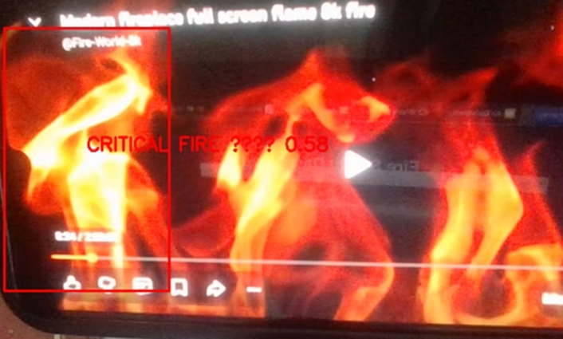
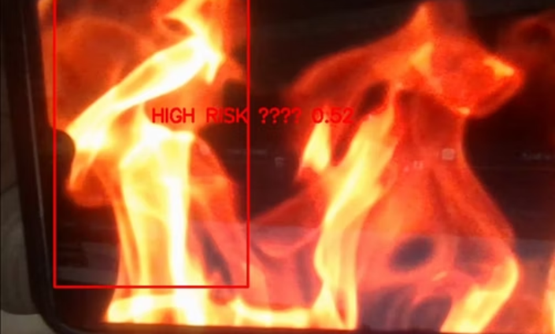
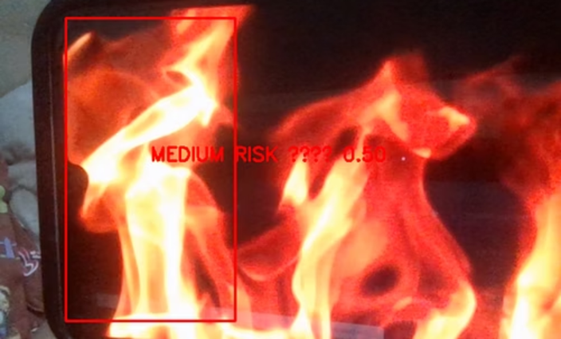

# 🔥 Fire Risk Detection AI

AI-powered real-time fire and smoke risk detection system using computer vision and intelligent hazard analysis.

---

## 🚀 Overview

This project is designed to monitor live video feeds and intelligently classify fire hazards based on environmental context and severity.

Unlike traditional fire detection systems, this system focuses on:

- 🔥 Fire & smoke detection
- 🧠 Context-aware risk analysis
- ⚡ Real-time AI inference
- 🚨 Automated hazard classification
- 📹 CCTV/live camera monitoring

The goal is to improve emergency response quality using intelligent AI-based surveillance systems.

---

## 🎥 Live Demo

<p align="center">
  <video src="demo/Fire Detection.mp4" controls width="90%"></video>
</p>

> Full demo video available in `/demo`

---

## 📸 Context-Aware Risk Classification

<table>
<tr>
<td align="center">

### 🔴 Critical Risk
Highly flammable environments requiring immediate emergency response.



</td>

<td align="center">

### 🟠 High Risk
Electrical systems and rapid-spread hazard environments.



</td>
</tr>

<tr>
<td colspan="2" align="center">

### 🟡 Medium Risk
Standard fire hazard environments with manageable spread.



</td>
</tr>
</table>

---

## 🧠 Core Features

- 🔥 Real-time Fire Detection
- 🌫️ Smoke Detection
- 📹 Multi-camera Monitoring
- ⚡ AI-powered Inference
- 🚨 Hazard Classification
- 🧠 Context-Based Risk Analysis
- 📊 Dashboard Monitoring
- 🔍 Live Object Detection

---

## 🛠️ Tech Stack

| Technology | Usage |
|---|---|
| Python | Core Development |
| OpenCV | Computer Vision |
| YOLOv8 | Detection Models |
| Flask | Backend Dashboard |
| NumPy | Data Processing |
| AI Models | Hazard Classification |

---

## 📂 Project Structure

```text
fire-risk-detection-ai/
│
├── demo/
├── docs/
├── screenshots/
└── README.md
```

---

## 📄 Documentation

Detailed architecture, screenshots, workflow, and system explanation available inside:

```text
/docs
```

---

## 🌍 Real-World Applications

- Smart Surveillance Systems
- Industrial Safety Monitoring
- AI-powered Emergency Detection
- Smart Buildings
- Automated Fire Monitoring
- Hazard Intelligence Systems

---

## 🔒 Source Code Status

> Source code is currently private while the project is under active development.

---

## 📌 Future Improvements

- Edge AI Deployment
- IoT Sensor Integration
- Cloud Dashboard
- Mobile Alert System
- Multi-camera Risk Tracking
- AI Threat Prediction

---

## 👨‍💻 Author

### Vineet Shah
AI • Computer Vision • Full Stack Development

<div align="center">

<a href="https://github.com/vinuah-dev" style="margin-right: 24px;">
  
</a>

<br>

<a href="https://www.linkedin.com/in/vineet-shah-70263721a/" style="margin-right: 24px;">
  
</a>

<br>

<a href="https://www.instagram.com/vinuah999">
  
</a>

</div>

---

<p align="center">
  
</p>
